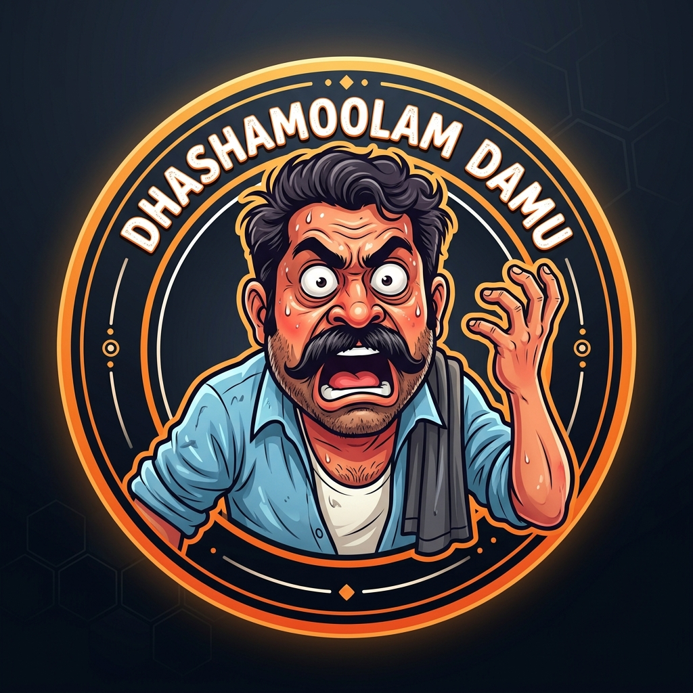
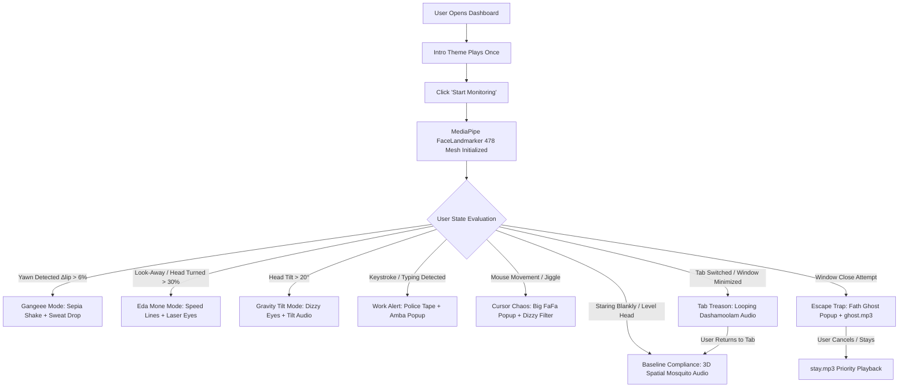

# Dashamoolam Damu 🎯
### *The Mandatory Vegetative State Enforcer*

## Basic Details
### Team Name: 2Pac

### Team Members
- Team Lead: Gautham Anil - Model Engineering College

### Hosted Project Link
🔗 **[https://uselessprojectdhashamoolamdamu.vercel.app/](https://uselessprojectdhashamoolamdamu.vercel.app/)**

### Project Description
Project Dashamoolam Damu is a state-of-the-art time-wasting engine disguised as a premium productivity SaaS. Leveraging MediaPipe facial telemetry and browser event traps, it forces users into a mandatory vegetative state. The core objective is to reduce productivity to absolute zero. If the user attempts to type, move their mouse, or switch tabs to actually do work, the app punishes them with immediate Malayalam meme jump-scares, screen-shaking CSS feedback, and cursor deletion. It provides absolutely zero ROI, solves no real-world problems, and guarantees that any time spent using it is permanently wasted.

### The Problem (that doesn't exist)
Modern society is suffering from a catastrophic epidemic: **Toxic Productivity**.

Developers, students, and professionals are addicted to "adding value," writing code, and achieving goals. Current software ecosystems are entirely designed to help people do things faster and better. There is a severe lack of premium, high-tech infrastructure dedicated to aggressively wasting a user’s time. People simply do not know how to sit at a desk, stare at a screen, and achieve absolutely nothing for hours at a time.

### The Solution (that nobody asked for)
Project Dashamoolam Damu is a paradigm-shifting, zero-benefit web application designed to completely derail human productivity.

Disguised as a minimalist, premium SaaS productivity dashboard, the app uses zero-latency computer vision and browser traps to mandate a state of total physical uselessness:
- **The Anti-Work Telemetry Engine**: Uses MediaPipe facial tracking (478 landmarks + iris) to ensure the user is just sitting there. Staring blankly is rewarded with a soothing, inescapable 3D orbiting mosquito buzz. Looking away to check a notebook or read actual code terminates compliance and deploys *Eda Mone* mode.
- **Productivity Punishment Protocol**: Any engagement with the keyboard (typing) or cursor (moving/jiggling) is treated as a critical violation. Keystrokes deploy emergency police tape banners, alarm sirens, and Amba pop-ups; mouse movement triggers Big FaFa pop-ups and psychedelic dizzy distortions.
- **The "Engotta?" Tab Treason Trap**: Exploiting the Page Visibility API, the system actively prevents users from escaping to useful applications like VS Code or StackOverflow. Attempting to switch tabs or minimize results in relentless *Dashamoolam* audio screaming in a loop through the speakers until the user submits, returns to the app, and resumes doing nothing.
- **Window Escape & Stay Trap**: Fleeing towards the close button triggers *Fath Ghost* pop-ups and *ghost.mp3*. Deciding to stay rewards the user with *stay.mp3*.
- **Floating Watcher (PiP Exploit)**: Spawns an inescapable Picture-in-Picture live video HUD to haunt the user across their entire operating system.

---

## Technical Details
### Technologies/Components Used

For Software:
- **Languages**: HTML5, Vanilla CSS3 (Custom Design System & Anime/Pop-Art Visual Effects), JavaScript (ES6+ Modules)
- **Frameworks**: Vanilla JS (Zero heavyweight framework overhead)
- **Libraries & APIs**:
  - `@mediapipe/tasks-vision` (WebAssembly FaceLandmarker with 478 face + iris mesh)
  - Web Audio API (StereoPannerNode 3D Spatial mosquito audio + sound synthesizer)
  - HTML5 Canvas 2D (Real-time mesh overlay, laser eyes, menacing kanji, anime lightning sparks)
  - Picture-in-Picture API (System-wide floating surveillance watcher)
  - Page Visibility API & BeforeUnload Trap (Tab switching detection & window close interceptor)
- **Design & Typography**: Google Fonts (`Bangers`, `Fredoka`, `JetBrains Mono`), Comic Pop-Art cel-shaded aesthetic

For Hardware:
- Standard Webcam / Integrated Laptop Camera

---

### Implementation

For Software:

#### Installation
```bash
# Clone the repository
git clone https://github.com/weBroz/useless_project_temp.git

# Navigate to the project directory
cd useless_project_temp
```

#### Run
```bash
# Serve locally with any static file server (e.g. serve or VS Code Live Server)
npx serve .
# Or open index.html directly in a modern web browser with webcam access enabled
```

---

### Project Documentation

For Software:

#### Screenshots

*Main Enforcement Interface: Cel-shaded webcam feed with 478 facial landmarks, real-time compliance telemetry, and comic pop-art HUD.*


*Vibrant Golden Cartoon Aesthetic & Anti-Productivity Theme with manga speedlines and pop-up triggers.*


*Dynamic Meme Pop-up System (FaFa, Fath Ghost, and Amba) deployed on unauthorized movement and keystrokes.*

#### Diagrams

*System Architecture & Anti-Productivity Punishment Flow*

---

### Project Demo
#### Live Deployment
🔗 **[https://uselessprojectdhashamoolamdamu.vercel.app/](https://uselessprojectdhashamoolamdamu.vercel.app/)**

#### Video
[Add your demo video link here]
*Demonstration of MediaPipe real-time face tracking, tab treason interceptors, cursor deletion, and Malayalam meme punishment audio.*

#### Additional Demos
[Add any extra demo materials/links]

---

## Team Contributions
- **Gautham Anil**: End-to-end architecture, MediaPipe facial tracking integration, Web Audio API 3D spatial sound engine, browser event traps (Page Visibility & PiP), UI/UX anime pop-art design system, and meme pop-up integrations.

---
Made with ❤️ at TinkerHub Useless Projects 


